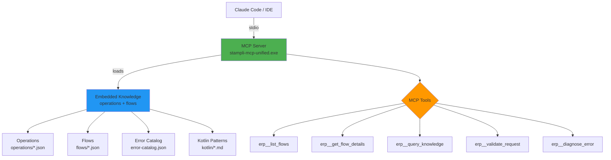
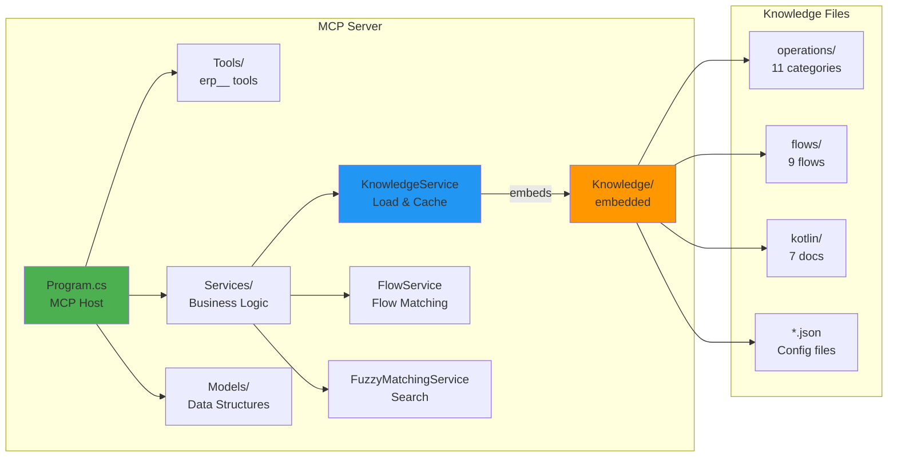
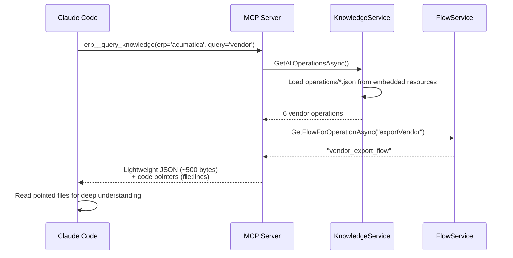
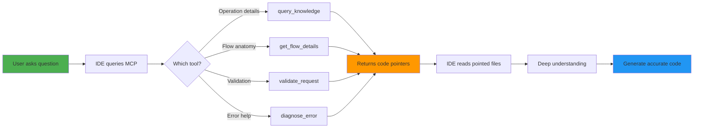

# Acumatica MCP Server Architecture

## System Flow

## Component Architecture

## Data Flow: Operation Query

## Request/Response Pattern

## Key Insights

1. **Code GPS, Not Document Dumper**
   - MCP returns lightweight metadata (~500 bytes)
   - Points to exact file locations (file:line_range)
   - IDE reads files for deep context
   - Result: ~10KB context vs 50KB+ dump

2. **Embedded Knowledge**
   - All 51 files compiled into exe
   - Single-file deployment (~108 MB)
   - No runtime file path issues
   - Trade-off: Rebuild required for knowledge changes

3. **Flow-Based Architecture**
   - 9 proven integration patterns
   - Operations reference flows
   - Flow anatomy + constants + validation rules
   - Reusable across operations

4. **Auto-Discovery**
   - Flows auto-discovered from embedded resources
   - No C# code changes to add flows
   - Categories require KnowledgeService.cs mapping
