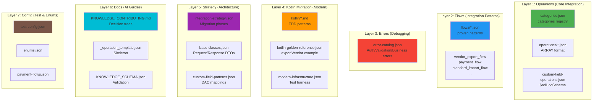
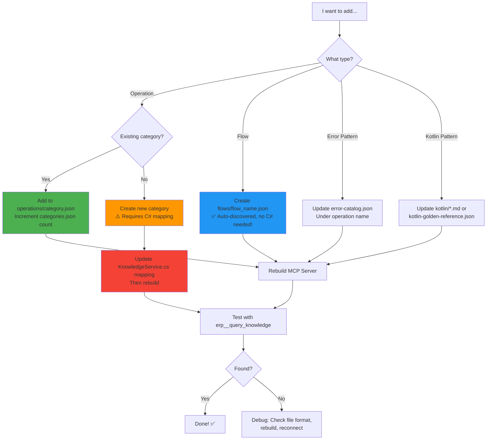
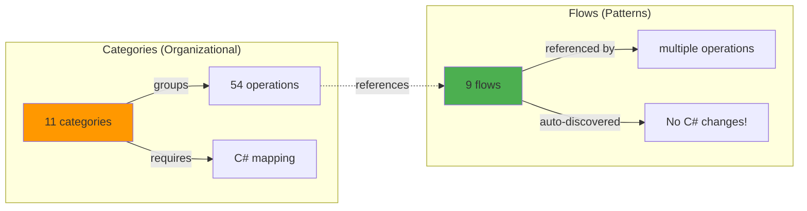
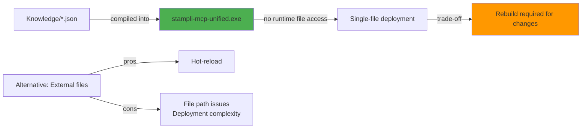
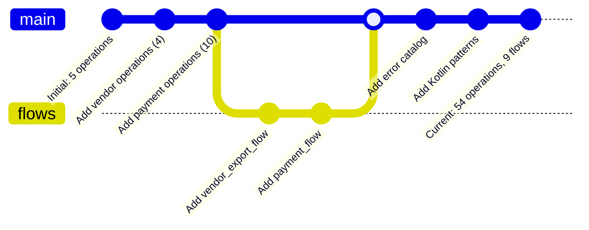
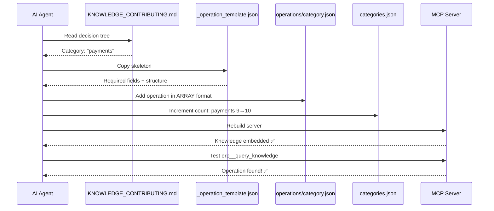

# Knowledge System Structure

## 7-Layer Knowledge Architecture



## Knowledge File Structure

```
Knowledge/
├── Layer 1: Operations (What to do)
│   ├── categories.json                     ← Registry of 11 categories
│   ├── operations/                         ← Rich operation knowledge
│   │   ├── vendors.json (4 ops)
│   │   ├── items.json (2 ops)
│   │   ├── purchaseOrders.json (6 ops)
│   │   ├── payments.json (10 ops)
│   │   ├── accounts.json (6 ops)
│   │   ├── fields.json (10 ops)
│   │   ├── admin.json (9 ops)
│   │   ├── retrieval.json (1 op)
│   │   ├── utility.json (2 ops)
│   │   └── other.json (2 ops)
│   └── custom-field-operations.json (5 ops)
│
├── Layer 2: Flows (How to do it)
│   └── flows/
│       ├── vendor_export_flow.json
│       ├── payment_flow.json
│       ├── standard_import_flow.json
│       ├── po_matching_flow.json
│       ├── po_matching_full_import_flow.json
│       ├── export_invoice_flow.json
│       ├── export_po_flow.json
│       ├── m2m_import_flow.json
│       └── api_action_flow.json
│
├── Layer 3: Errors (What went wrong)
│   └── error-catalog.json
│
├── Layer 4: Kotlin (Modern patterns)
│   ├── kotlin/
│   │   ├── GOLDEN_PATTERNS.md (433 lines)
│   │   ├── KOTLIN_ARCHITECTURE.md (171 lines)
│   │   ├── TDD_WORKFLOW.md (318 lines)
│   │   ├── ACUMATICA_COMPLETE_ANALYSIS.md (1341 lines)
│   │   ├── kotlin-integration.json
│   │   ├── method-signatures.json
│   │   ├── error-patterns-kotlin.json
│   │   └── test-config-kotlin.json
│   ├── kotlin-golden-reference.json
│   ├── kotlin-reality.json
│   └── modern-infrastructure.json
│
├── Layer 5: Strategy (Architecture)
│   ├── integration-strategy.json
│   ├── base-classes.json
│   ├── custom-field-patterns.json
│   └── method-signatures.json
│
├── Layer 6: Docs (How to add knowledge)
│   ├── KNOWLEDGE_CONTRIBUTING.md (697 lines)
│   ├── _operation_template.json
│   └── KNOWLEDGE_SCHEMA.json
│
└── Layer 7: Config (Test & Enum data)
    ├── test-config.json
    ├── enums.json
    ├── payment-flows.json
    └── reflection-mechanism.json
```

## Adding Knowledge: Decision Tree



## Knowledge Statistics

| Layer | Files | Lines | Purpose |
|-------|-------|-------|---------|
| **Operations** | 12 | ~3000 | Individual methods |
| **Flows** | 9 | ~900 | Reusable patterns |
| **Errors** | 1 | ~400 | Known errors/fixes |
| **Kotlin** | 10 | ~2500 | Modern patterns |
| **Strategy** | 4 | ~600 | Architecture |
| **Docs** | 3 | ~750 | AI guides |
| **Config** | 4 | ~200 | Test/enum data |
| **TOTAL** | 43 | ~9350 | Complete knowledge |

## Key Architectural Insights

### 1. Categories vs Flows



### 2. Embedded vs External



### 3. Knowledge Growth Pattern



## How AI Adds Knowledge



## Summary

**Knowledge System = 7 Layers of Intelligence**

1. **Operations** → What operations exist
2. **Flows** → How to implement them
3. **Errors** → What can go wrong
4. **Kotlin** → Modern implementation patterns
5. **Strategy** → Architecture decisions
6. **Docs** → How to add knowledge
7. **Config** → Test/enum metadata

**Result**: AI-friendly, searchable, maintainable knowledge base powering intelligent code generation!
