# TDD Workflow for Acumatica Development

## Complete TDD Cycle

```mermaid
flowchart TD
    A[Feature Request] --> B[Query MCP for Intelligence]
    B --> C[erp__query_knowledge<br/>Get operation details]
    C --> D[Scan Legacy Code<br/>Using MCP pointers]

    D --> E[Write Test FIRST<br/>RED Phase ❌]
    E --> F{Test Runs?}
    F -->|No| G[Good! True TDD]
    F -->|Yes| H[ERROR: Test passes without code!]

    G --> I[Implement Feature<br/>GREEN Phase ✅]
    I --> J{Test Passes?}
    J -->|No| K[Debug & Fix]
    K --> J
    J -->|Yes| L[Refactor<br/>BLUE Phase 🔧]

    L --> M{All Tests Pass?}
    M -->|No| K
    M -->|Yes| N[Add to MCP Knowledge]
    N --> O[Update operations/*.json]
    O --> P[Rebuild MCP Server]
    P --> Q[Done! ✅]

    style E fill:#f44336
    style I fill:#4CAF50
    style L fill:#2196F3
    style N fill:#FF9800
```



## MCP-Driven TDD

```mermaid
sequenceDiagram
    participant Dev as Developer
    participant MCP as MCP Server
    participant Code as Codebase
    participant Test as Test Suite

    Dev->>MCP: "How do I implement exportVendor?"
    MCP-->>Dev: Flow: vendor_export_flow<br/>Files: CreateVendorHandler.java:22-90<br/>Validations: vendorName required, max 60 chars

    Dev->>Code: Read CreateVendorHandler.java:22-90
    Code-->>Dev: Validation rules, error messages

    Dev->>Test: Write Kotlin test (FIRST!)
    Note over Test: @Test fun `export vendor fails without name`
    Dev->>Test: Run test
    Test-->>Dev: ❌ FAILS (good - TDD RED)

    Dev->>Code: Implement in Java
    Dev->>Test: Run test again
    Test-->>Dev: ✅ PASSES (TDD GREEN)

    Dev->>Code: Refactor if needed
    Dev->>Test: Run all tests
    Test-->>Dev: ✅ ALL PASS

    Dev->>MCP: Update knowledge with learnings
    MCP-->>Dev: Knowledge added ✅
```



## TDD Step Details

### Step 1: Query MCP
```bash
Tool: erp__query_knowledge
Parameters: { "erp": "acumatica", "query": "exportVendor", "scope": "operations" }

Returns:
- Required fields with validation rules
- Error messages for assertions
- Code pointers to scan
- Flow reference
```

### Step 2: Scan Legacy Code
```kotlin
// MCP provides exact locations
"scanThese": [
  {
    "file": "finsys-drivers/acumatica/.../CreateVendorHandler.java",
    "lines": "22-90",
    "purpose": "Validation logic"
  }
]

// Scan to understand:
- Validation rules
- Error messages
- Business logic
- API payload format
```

### Step 3: Write Test FIRST (Red Phase ❌)
```kotlin
@Test
fun `export vendor validation error - missing name`() {
    // Arrange
    val request = createRequest(vendorName = "")

    // Act
    val response = driver.exportVendor(request)

    // Assert - Use exact error message from MCP
    assertNotNull(response.error)
    assertEquals("vendorName is required", response.error)
}
```

### Step 4: Verify Failure
```bash
./gradlew test --tests KotlinAcumaticaDriverTest

Expected: Test FAILS (no implementation yet)
```

### Step 5: Implement (Green Phase ✅)
```java
// CreateVendorHandler.java
public static ExportResponse execute(...) {
    String vendorName = raw.get("vendorName");
    if (StringUtils.isBlank(vendorName)) {
        response.setError("vendorName is required");
        return response;
    }
    // ... rest of implementation
}
```

### Step 6: Verify Success
```bash
./gradlew test --tests KotlinAcumaticaDriverTest

Expected: Test PASSES ✅
```

### Step 7: Refactor (Blue Phase 🔧)
- Extract methods
- Remove duplication
- Improve readability
- Run tests after each change

### Step 8: Add to MCP Knowledge
```bash
Tool: erp__knowledge_update_plan
Parameters: {
  "erp": "acumatica",
  "prNumber": "PR-123",
  "learnings": "exportVendor validation requires vendorName (max 60 chars). See CreateVendorHandler.java:22-90",
  "dryRun": true
}
```

## TDD Benefits


## Common Pitfalls

| Pitfall | Fix |
|---------|-----|
| Test passes without code | Write test FIRST, verify it fails |
| Skipping MCP query | Use query_acumatica_knowledge for guidance |
| Not scanning legacy code | Read files MCP points to |
| Weak assertions | Use exact error messages from MCP |
| Forgetting to add knowledge | Update operations/*.json after PR |

## Key Takeaways

1. ✅ **Always write test FIRST**
2. ✅ **Use MCP to guide implementation**
3. ✅ **Scan legacy code for patterns**
4. ✅ **Verify RED → GREEN → REFACTOR cycle**
5. ✅ **Add learnings back to MCP knowledge**
